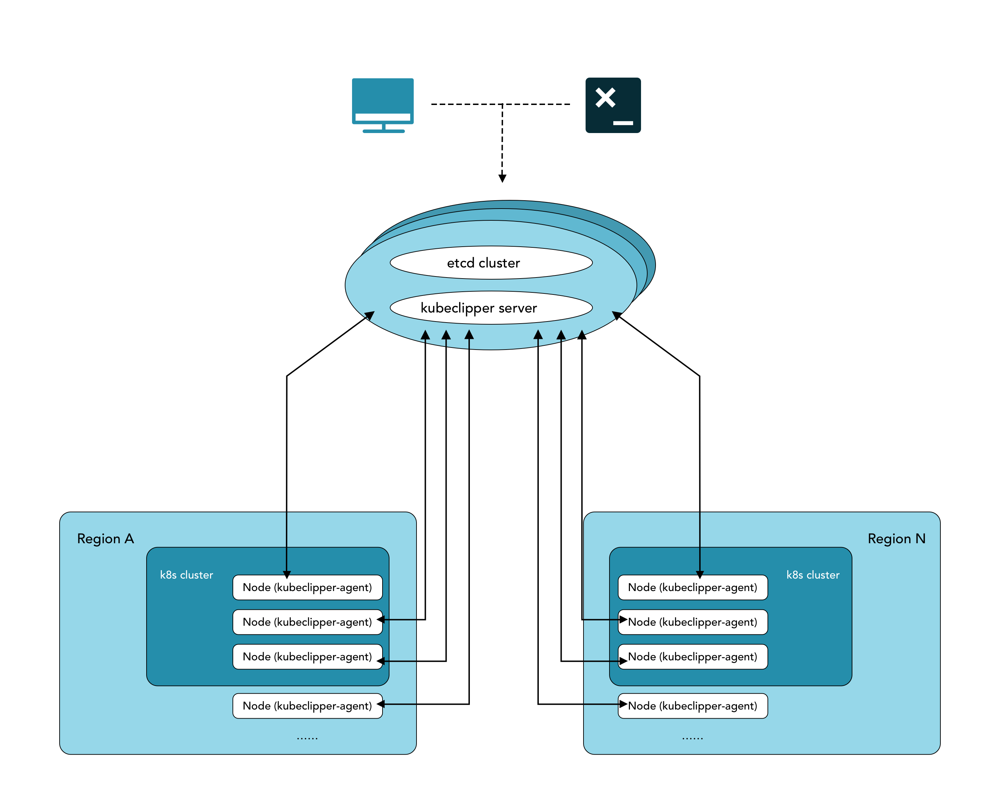
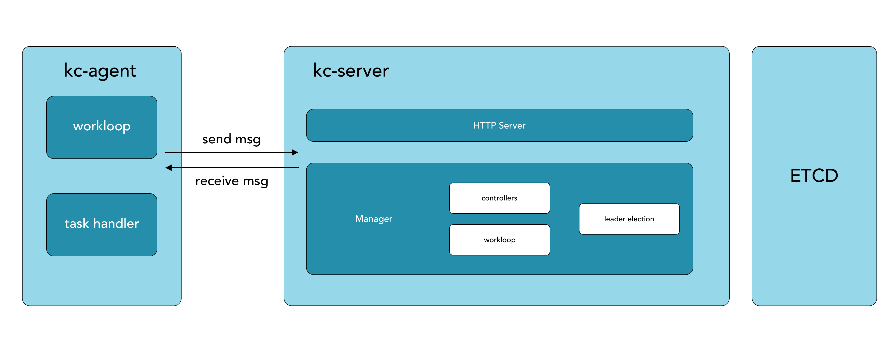
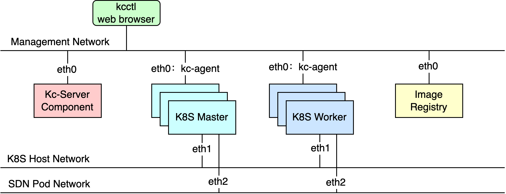
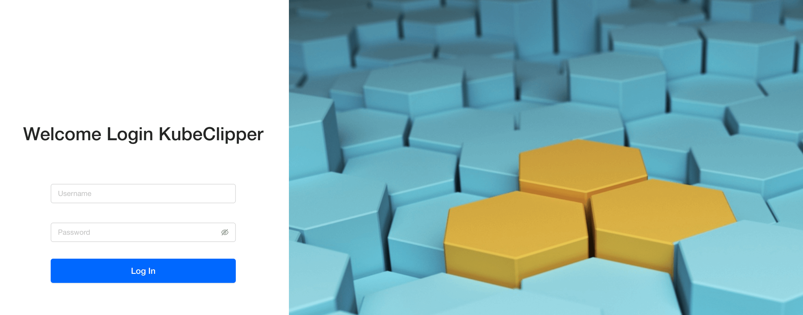

<p align="center">
<a href="https://kubeclipper.io/"></a>
</p>

<p align="center">
<b>Manage kubernetes in the most light and convenient way</b>
</p>

<!-- TODO: 添加 cicd 执行情况，代码质量等标签 -->

<p align="center">
  -000000?style=flat-square&logo=github&logoColor=white" />
  <a href="https://codecov.io/gh/kubeclipper/kubeclipper" target="_blank"></a>
  
  <a href="https://www.codacy.com/gh/kubeclipper/kubeclipper/dashboard?utm_source=github.com&amp;utm_medium=referral&amp;utm_content=kubeclipper/kubeclipper&amp;utm_campaign=Badge_Grade"></a>
  
  
  
  
  
  
  
</p>

<p align="center">
  -000000?style=flat-square&logo=github-actions&logoColor=white" />
  
  
</p>

---

## What is KubeClipper

> English | [中文](README_zh.md)

[KubeClipper](https://kubeclipper.io/) is a lightweight web service that provides a friendly web console GUI, APIs, and a CLI tool for **Kubernetes cluster lifecycle management**.  
KubeClipper provides flexible Kubernetes as a Service (KaaS), which allows users to rapidly deploy K8S clusters 
anywhere(cloud, hypervisor, bare metal) and provides continuous lifecycle management capabilities 
(installation, deleting, upgrading, backup and restoration, cluster scaling, remote access, plug-in management, 
application store).see [Feature List](https://github.com/kubeclipper/kubeclipper#features) for details.

**🎯 Project Goal**：Manage Kubernetes in the most light and convenient way.

## Features

<details>
  <summary><b>☸️ Cluster Lifecycle Management</b></summary>
  Supports deployment of Kubernetes on any infrastructure and provides comprehensive cluster lifecycle management.

  <ul>
  <li>Lifecycle Management: cluster creation, deletion, backup, restoration, upgrade, and node manipulation</li>
  <li>Multiple Deployment Modes: online/offline deployment support</li>
  <li>Multi-Architecture: x86/64 &amp; arm64 support</li>
  <li>Cluster Import: registration and management of external clusters (non-Kubeclipper created)</li>
  <li>...</li>
  </ul>
</details>

<details>
  <summary><b>🌐 Node Management</b></summary>
  <ul>
  <li>Automatic node registration</li>
  <li>Node information collection</li>
  <li>Node terminal</li>
  <li>...</li>
  </ul>
</details>

<details>
  <summary><b>🚪 Identity and Access Management (IAM)</b></summary>
  Provides a unified authentication and authorization system with fine-grained role-based access control.

  <ul>
  <li>RBAC-based user permission system</li>
  <li>OIDC integration</li>
  <li>...</li>
  </ul>
</details>

## Roadmap & Todo list
* 🚀 Cluster Installation Optimization 
  * Use images to encapsulate installation package resources to reduce complexity. Reuse mature image technology
* 💻 Kubernetes Web Console 
  * Workload resources & monitoring presentation
  * Tenant based cluster access control
* 📦 Application Store 
  * Application lifecycle management 
  * Support web UI & CLI interface
* 🧩 Common Application and Plugin Integrations 
  * LB & Ingress 
  * Monitoring 
  * Kubernetes Dashboard 
  * KubeEdge
* 🕸 Managed Clusters
  * Support KoK clusters.

## Architecture
### Core

### Node

### Network


Explore the architecture of Kubeclipper on [kubeclipper.io](https://kubeclipper.io/docs/overview/).

## Quick Start

For users who are new to KubeClipper and want to get started quickly, it is recommended to use the All-in-One installation mode, which can help you quickly deploy KubeClipper with zero configuration.

### Preparations

KubeClipper itself does not take up too many resources, but in order to run Kubernetes better in the future,  it is recommended that the hardware configuration should not be lower than the minimum requirements.

You only need to prepare a host with reference to the following requirements for machine hardware and operating system.

#### Hardware recommended configuration

- Make sure your machine meets the minimum hardware requirements: CPU >= 2 cores, RAM >= 2GB.
- Operating System: CentOS 7.x / Ubuntu 18.04 / Ubuntu 20.04.

#### Node requirements

- Nodes must be able to connect via `SSH`.

- You can use the `sudo` / `curl` / `wget` / `tar` command on this node.

> It is recommended that your operating system is in a clean state (no additional software is installed), otherwise, conflicts may occur.


### Deploy KubeClipper

#### Download kcctl

KubeClipper provides command line tools 🔧 kcctl to simplify operations.

You can download the latest version of kcctl directly with the following command:

```bash
# Install latest release
curl -sfL https://oss.kubeclipper.io/get-kubeclipper.sh | bash -
# In China, you can add env "KC_REGION=cn", we use registry.aliyuncs.com/google_containers instead of k8s.gcr.io
curl -sfL https://oss.kubeclipper.io/get-kubeclipper.sh | KC_REGION=cn bash -
# The latest release version is downloaded by default. You can download the specified version. For example, specify the master development version to be installed
curl -sfL https://oss.kubeclipper.io/get-kubeclipper.sh | KC_REGION=cn KC_VERSION=master bash -
```

> It is highly recommended that you install the latest release to experience more features.  
> You can also download the specified version on the **[GitHub Release Page](https://github.com/kubeclipper/kubeclipper/releases)**.

Check if the installation is successful with the following command:

```bash
kcctl version
```

#### Get Started with Installation

In this quick start tutorial, you only need to run  just one command for installation:

If you want to install AIO mode

```bash
# install default release
kcctl deploy
# you can use KC_VERSION to install the specified version, default is latest release
KC_VERSION=master kcctl deploy
```

If you want to install multi node, Use `kcctl deploy -h` for more information about a command

After you runn this command, kcctl will check your installation environment and enter the installation process, if the conditions are met.

After printing the KubeClipper banner, the installation is complete.

```bash
 _   __      _          _____ _ _
| | / /     | |        /  __ \ (_)
| |/ / _   _| |__   ___| /  \/ |_ _ __  _ __   ___ _ __
|    \| | | | '_ \ / _ \ |   | | | '_ \| '_ \ / _ \ '__|
| |\  \ |_| | |_) |  __/ \__/\ | | |_) | |_) |  __/ |
\_| \_/\__,_|_.__/ \___|\____/_|_| .__/| .__/ \___|_|
                                 | |   | |
                                 |_|   |_|
```

### Login Console

When deployed successfully, you can open a browser and visit `http://$IP ` to enter the KubeClipper console.



 You can log in with the default account and password `admin / Thinkbig1 `.

> You may need to configure port forwarding rules and open ports in security groups for external users to access the console.

### Create a k8s cluster

When `kubeclipper` is deployed successfully, you can use the **kcctl** **tool** or **console** to create a  k8s cluster. In the quick start tutorial, we use the kcctl tool to create.

Then create a k8s cluster with the following command:

```bash
NODE=$(kcctl get node -o yaml|grep ipv4DefaultIP:|sed 's/ipv4DefaultIP: //')

kcctl create cluster --master $NODE --name demo --untaint-master
```

The cluster creation will be completed in about 3 minutes, or you can use the following command to view the cluster status:

```bash
kcctl get cluster -o yaml|grep status -A5
```

> You can also enter the console to view real-time logs.

Once the cluster enter  the `Running` state , it means that the creation is complete. You can use `kubectl get cs` command to view the cluster status.

## Development and Debugging

1. fork repo and clone
2. run etcd locally, usually use docker / podman to run etcd container
   ```bash
   export HostIP="Your-IP"
   docker run -d \
   --net host \
   k8s.gcr.io/etcd:3.5.0-0 etcd \
   --advertise-client-urls http://${HostIP}:2379 \
   --initial-advertise-peer-urls http://${HostIP}:2380 \
   --initial-cluster=infra0=http://${HostIP}:2380 \
   --listen-client-urls http://${HostIP}:2379,http://127.0.0.1:2379 \
   --listen-metrics-urls http://127.0.0.1:2381 \
   --listen-peer-urls http://${HostIP}:2380 \
   --name infra0 \
   --snapshot-count=10000 \
   --data-dir=/var/lib/etcd
   ```
3. change `kubeclipper-server.yaml` etcd.serverList to your locally etcd cluster
4. `make build`
5. `./dist/kubeclipper-server serve`

## Contributing

Please follow [Community](https://github.com/kubeclipper/community) to join us.

## Star History


