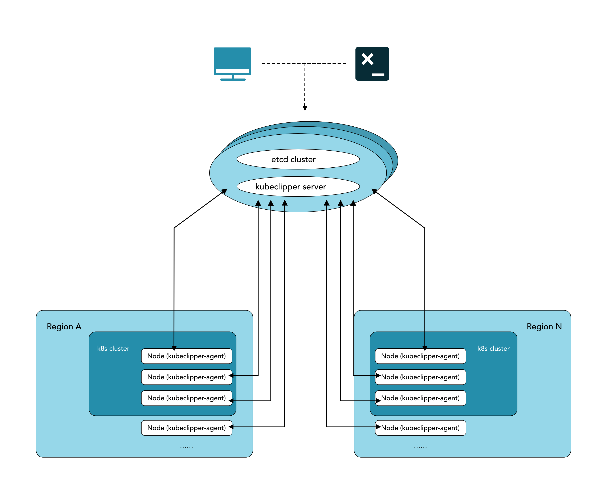
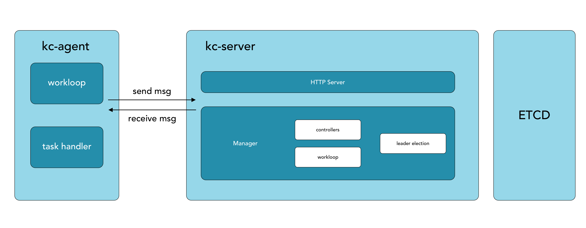
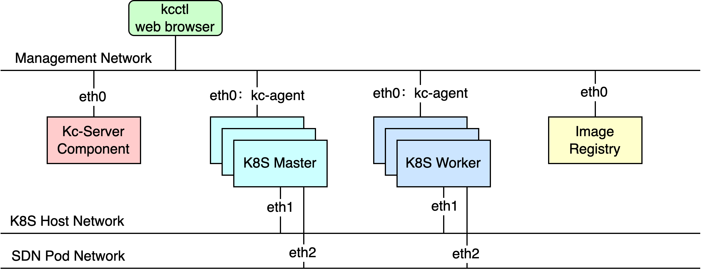
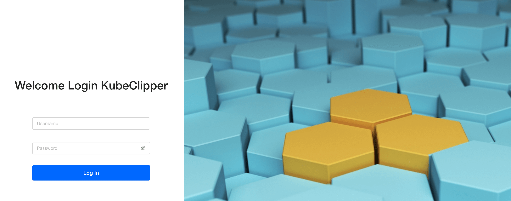

<p align="center">
<a href="https://kubeclipper.io/"></a>
</p>

<p align="center">
<b>Manage kubernetes in the most light and convenient way</b>
</p>

<p align="center">
  -000000?style=flat-square&logo=github&logoColor=white" />
  <a href="https://codecov.io/gh/kubeclipper/kubeclipper" target="_blank"></a>
  
  <a href="https://www.codacy.com/gh/kubeclipper/kubeclipper/dashboard?utm_source=github.com&amp;utm_medium=referral&amp;utm_content=kubeclipper/kubeclipper&amp;utm_campaign=Badge_Grade"></a>
  
  
  
  
  
  
  
  
</p>

<p align="center">
  -000000?style=flat-square&logo=github-actions&logoColor=white" />
  
  
  
</p>

---

## 什么是 KubeClipper

> 中文 | [English](README.md)

[KubeClipper](https://kubeclipper.io/) 是一个轻量级的 Web 服务，为 **Kubernetes 集群生命周期管理**
提供友好的 Web 控制台 GUI、API 和 CLI 工具。\
KubeClipper 提供灵活的 Kubernetes 即服务（KaaS），允许用户在任何地方（云、虚拟机、裸机）快速部署 K8S
集群，并提供持续的生命周期管理功能（安装、删除、升级、备份和恢复、集群扩展、远程访问、插件管理、应用商店）。详细信息见 [功能列表](https://github.com/kubeclipper/kubeclipper/blob/master/README_zh.md#features)。

**🎯 项目目标**：以最轻松便捷的方式管理 Kubernetes。

## 🌟 CNCF 沙箱项目


KubeClipper 是 Cloud Native Computing Foundation (CNCF) 的沙箱项目和 [landscape](https://landscape.cncf.io/?item=platform--certified-kubernetes-installer--kubeclipper) 项目。

KubeClipper 已通过 [CNCF Kubernetes 一致性认证](https://www.cncf.io/certification/software-conformance/)。

## Features

<details>
  <summary><b>☸️ 集群生命周期管理</b></summary>
  支持在任何基础设施上部署 Kubernetes，并提供完整的集群生命周期管理。

<ul>
  <li>生命周期管理：支持集群创建、删除、备份、恢复、升级、增删节点</li>
  <li>多部署方式：在线/离线部署支持</li>
  <li>多架构：x86/64&arm64 支持</li>
  <li>集群导入：支持外部集群（非Kubeclipper创建）注册&管理</li>
  <li>...</li>
  </ul>
</details>

<details>
  <summary><b>🌐 节点管理</b></summary>
  <ul>
  <li>节点自动注册</li>
  <li>节点信息收集</li>
  <li>节点终端</li>
  <li>...</li>
  </ul>
</details>

<details>
  <summary><b>🚪 身份和访问管理（IAM）</b></summary>
  提供统一的认证鉴权与细粒度的基于角色的授权系统。

<ul>
  <li>基于 RBAC 的用户权限系统</li>
  <li>OIDC 集成</li>
  <li>...</li>
  </ul>
</details>

## 支持的版本

| Kubernetes | Calico | Containerd |
|------------|--------|------------|
| v1.36.1 (默认) | v3.31.5 | v2.2.4 |
| v1.35.0 | v3.29.6 | v1.7.29 |
| v1.34.2 | v3.29.6 | v1.7.29 |

## Roadmap & Todo list

- 🚀 集群安装优化
  - 使用 OCI 镜像封装离线安装包，降低复杂度
- 💻 Kubernetes web console
  - 工作负载 & 监控显示
  - 基于租户的集群访问控制
- 📦 应用商店
  - 应用生命周期管理
  - 支持 Web UI 和 CLI 工具
- 🧩 常见应用程序和插件集成
  - LB & Ingress
  - Monitor
  - Kubernetes Dashboard
  - KubeEdge
  - ...
- 🕸 托管集群
  - 支持 KoK 集群

## Architecture

### Core



### Node



### Network



更多 Kubeclipper 架构信息见 [kubeclipper.io](https://kubeclipper.io/docs/overview/)。

## Quick Start

对于初次接触 KubeClipper 并想快速上手的用户，建议使用 All-in-One
安装模式，它能够帮助您零配置快速部署 KubeClipper。

### 准备工作

KubeClipper 本身并不会占用太多资源，但是为了后续更好的运行 Kubernetes 建议硬件配置不低于最低要求。

您仅需参考以下对机器硬件和操作系统的要求准备一台主机。

#### 硬件推荐配置

- 确保您的机器满足最低硬件要求：CPU >= 2 核，内存 >= 2GB。
- 操作系统：CentOS 7.x / Ubuntu 18.04 / Ubuntu 20.04。

#### 节点要求

- 节点必须能够通过 `SSH` 连接。
- 节点上可以使用 `sudo` / `curl` / `wget` / `tar` 命令。

> 建议您的操作系统处于干净状态（不安装任何其他软件），否则可能会发生冲突。

### 部署 KubeClipper

#### 下载 kcctl

KubeClipper 提供了命令行工具🔧 kcctl 以简化运维工作，您可以直接使用以下命令下载最新版 kcctl：

```bash
# 安装最新的 release 版本
curl -sfL https://oss.kubeclipper.io/get-kubeclipper.sh | bash -
# 如果你在中国，可以在安装时使用 `KC_REGION=cn` 环境变量，此时我们会使用 `registry.aliyuncs.com/google_containers` 代替 `k8s.gcr.io`
curl -sfL https://oss.kubeclipper.io/get-kubeclipper.sh | KC_REGION=cn bash -
# 默认会下载最新版本，你也可以通过指定 KC_VERSION 下载所需版本，比如安装 master 开发版本
curl -sfL https://oss.kubeclipper.io/get-kubeclipper.sh | KC_REGION=cn KC_VERSION=master bash -
```

> 强烈建议您安装最新的发布版本，体验更多功能特性。\
> 您也可以在 **[GitHub Release Page](https://github.com/kubeclipper/kubeclipper/releases)**
> 下载指定版本。

通过以下命令检查是否安装成功：

```bash
kcctl version
```

#### 开始安装

在本快速入门教程中，您只需执行一个命令即可安装 KubeClipper：

如果想运行 AIO 模式

```bash
# 安装默认版本
kcctl deploy
# 通过指定 KC_VERSION 的值，指定安装的版本，比如安装 master 分支
KC_VERSION=master kcctl deploy
```

如果想安装多节点环境，可以使用 `kcctl deploy -h` 获取更多帮助信息。

执行该命令后，`kcctl` 将检查您的安装环境，若满足条件将会进入安装流程。在打印出如下的 KubeClipper
banner 后即表示安装完成。

```console
_   __      _          _____ _ _
| | / /     | |        /  __ \ (_)
| |/ / _   _| |__   ___| /  \/ |_ _ __  _ __   ___ _ __
|    \| | | | '_ \ / _ \ |   | | | '_ \| '_ \ / _ \ '__|
| |\  \ |_| | |_) |  __/ \__/\ | | |_) | |_) |  __/ |
\_| \_/\__,_|_.__/ \___|\____/_|_| .__/| .__/ \___|_|
                                 | |   | |
                                 |_|   |_|
```

### 登录控制台

安装完成后，打开浏览器，访问 `http://$IP` 即可进入 KubeClipper 控制台。



您可以使用默认帐号密码 `admin / Thinkbig1` 进行登录。

> 您可能需要配置端口转发规则并在安全组中开放端口，以便外部用户访问控制台。

### 创建 k8s 集群

部署成功后您可以使用 **kcctl 工具**或者通过**控制台**创建 k8s 集群。在本快速入门教程中使用 kcctl
工具进行创建。

然后使用以下命令创建 k8s 集群:

```bash
NODE=$(kcctl get node -o yaml|grep ipv4DefaultIP:|sed 's/ipv4DefaultIP: //')

kcctl create cluster --master $NODE --name demo --untaint-master
```

大概 3 分钟左右即可完成集群创建,也可以使用以下命令查看集群状态

```bash
kcctl get cluster -o yaml|grep status -A5
```

> 您也可以进入控制台查看实时日志。

进入 Running 状态即表示集群安装完成,您可以使用 `kubectl get cs` 命令来查看集群健康状况。

## 开发和调试

参考：[开发笔记](docs/dev-guide.md)

1. fork repo and clone
2. 本地运行 etcd, 通常使用 docker / podman 启动 etcd 容器，启动命令参考如下

   ```bash
   export HostIP="Your-IP"
   docker run -d \
   --net host \
   k8s.gcr.io/etcd:3.5.0-0 etcd \
   --advertise-client-urls http://${HostIP}:2379 \
   --initial-advertise-peer-urls http://${HostIP}:2380 \
   --initial-cluster=infra0=http://${HostIP}:2380 \
   --listen-client-urls http://${HostIP}:2379,http://127.0.0.1:2379 \
   --listen-metrics-urls http://127.0.0.1:2381 \
   --listen-peer-urls http://${HostIP}:2380 \
   --name infra0 \
   --snapshot-count=10000 \
   --data-dir=/var/lib/etcd
   ```

3. 更新 `kubeclipper-server.yaml` 中 etcd 的配置
4. `make build`
5. `./dist/kubeclipper-server serve`

## Contributing

请参考 [Community](https://github.com/kubeclipper/community) 的相关文档，加入我们

---

Copyright © contributors to KubeClipper, established as KubeClipper a Series of LF Projects, LLC.
