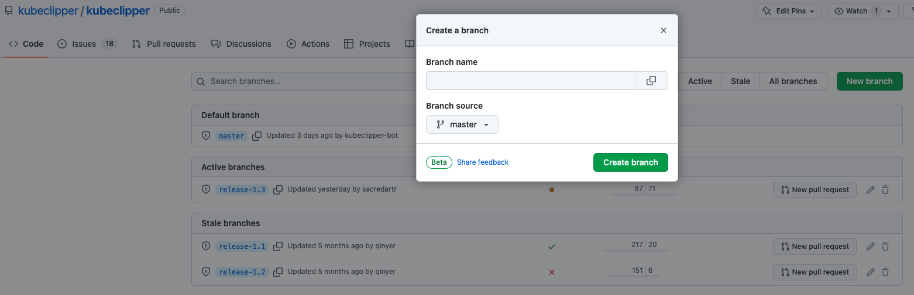
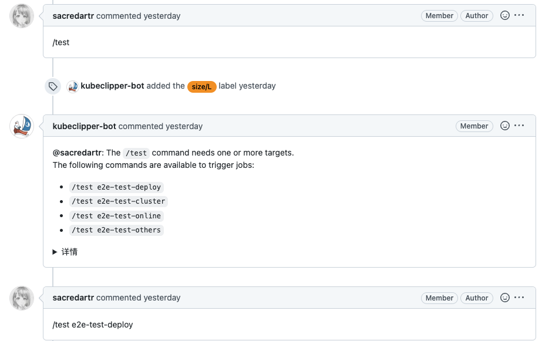
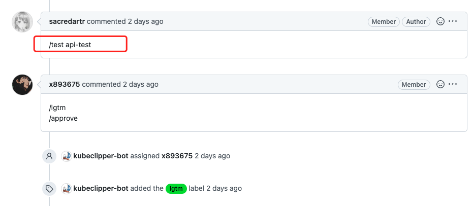
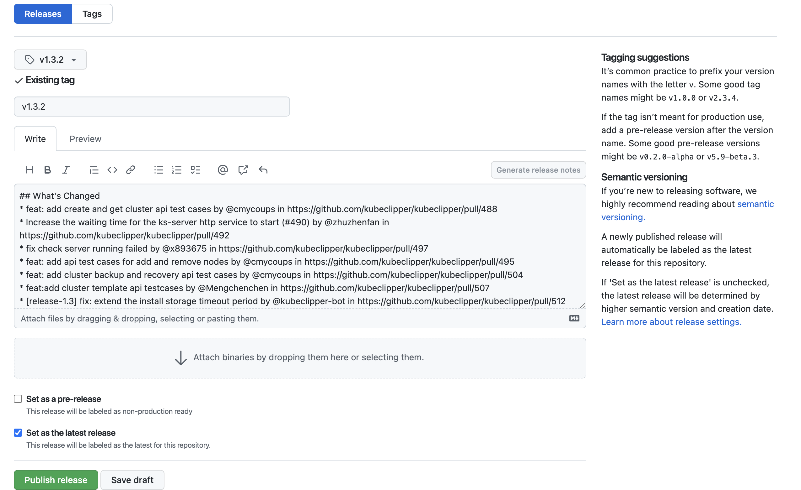
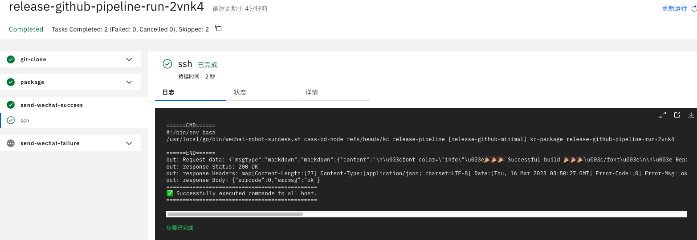

# Kubeclipper 发布流程

## 1. 新建分支

以`kubeclipper/kubeclipper` 为例:



*   `Branch name` 为新分支名称
*   `Branch source` 为现有分支，以现有分支为基础拉取分支
*   注意: 拉取分支需要有该项目的相应权限

## 2. 自动化测试

自动化测试采用提交 pr 后，添加 /test 标签触发相应测试任务

### 2.1 前端 e2e 测试

向 `kubeclipper/console` 项目下提交 pr，添加标签后触发测试任务



完成后可查看相应的测试报告及错误记录

### 2.2 后端 API 测试

向 `kubeclipper/kubeclipper` 项目下提交 pr，添加标签后触发测试任务



完成后可查看相应的测试报告及错误记录

## 3. 版本发布

### 3.1 新建 tag

以 `1.3.2` 为例

```bash
git tag -a v1.3.2
git push origin v1.3.2
``` 

### 3.2 发布

到 `kubeclipper/kubeclipper` 项目下点击 [Releases](https://github.com/kubeclipper/kubeclipper/releases) 到 releases 列表，选择最新的 tag 编辑



*   tag: 选择一个已经存在的 tag ，或者根据新的分支创建一个新的 tag
*   release note: 点击 Generate release note，自动生成
*   publish: 发布版本，也可以保存到草稿，后续修改完再发版

同样的，前端项目`kubeclipper/console` 点击 [Releases](https://github.com/kubeclipper/console/releases) 到 releases 列表，选择最新的 tag 编辑

### 3.3 发布总包

采用 tekton 新建一个  pipelinerun 任务 ，编辑好 yaml 文件后到指定的机器上 apply，看到任务成功运行



*   directive 参数为 [release-github-minimal]
*   kc-branch 参数为要发版的分支

### 3.4 发布总包冒烟测试

### 3.5 上传总包到 oss 中

  ```bash
  ossutil cp kc-amd64.tar.gz  oss://kubeclipper/release/分支名/
  ossutil cp kc-amd64.tar.gz.md5  oss://kubeclipper/release/分支名/
  ```
